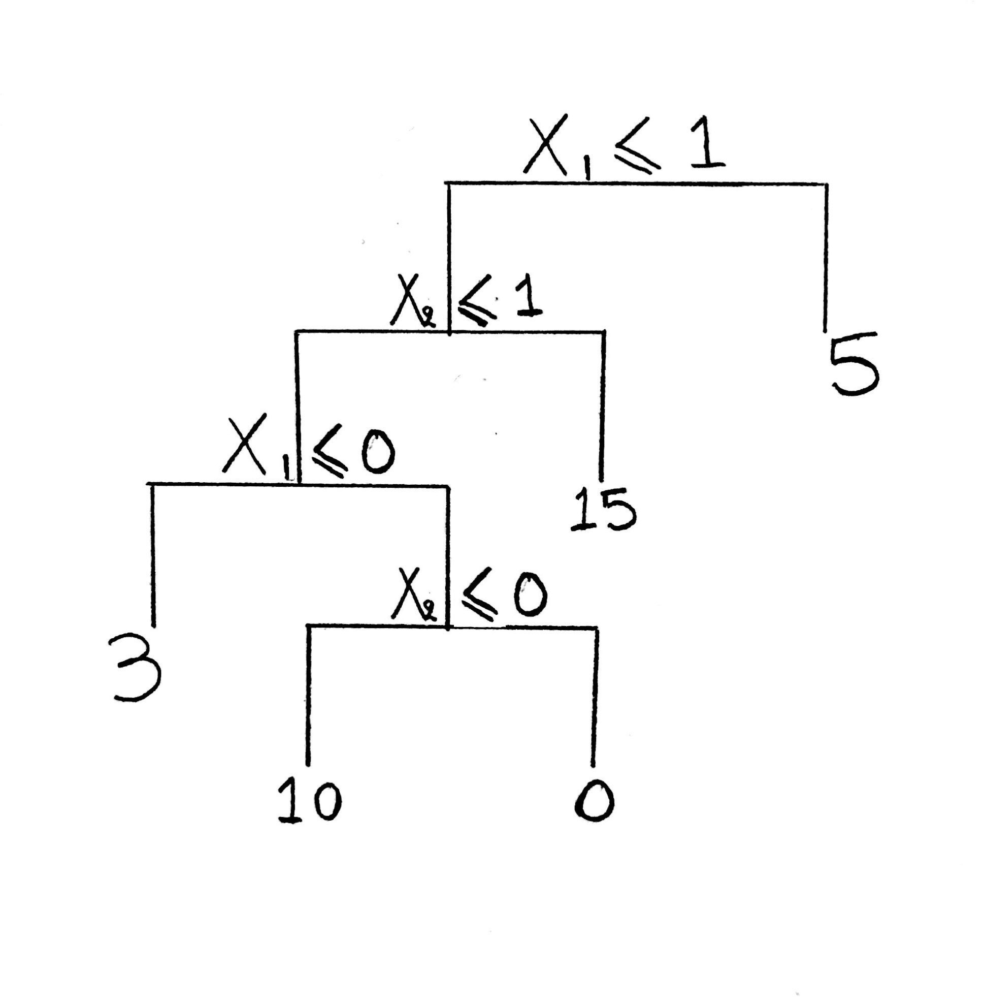
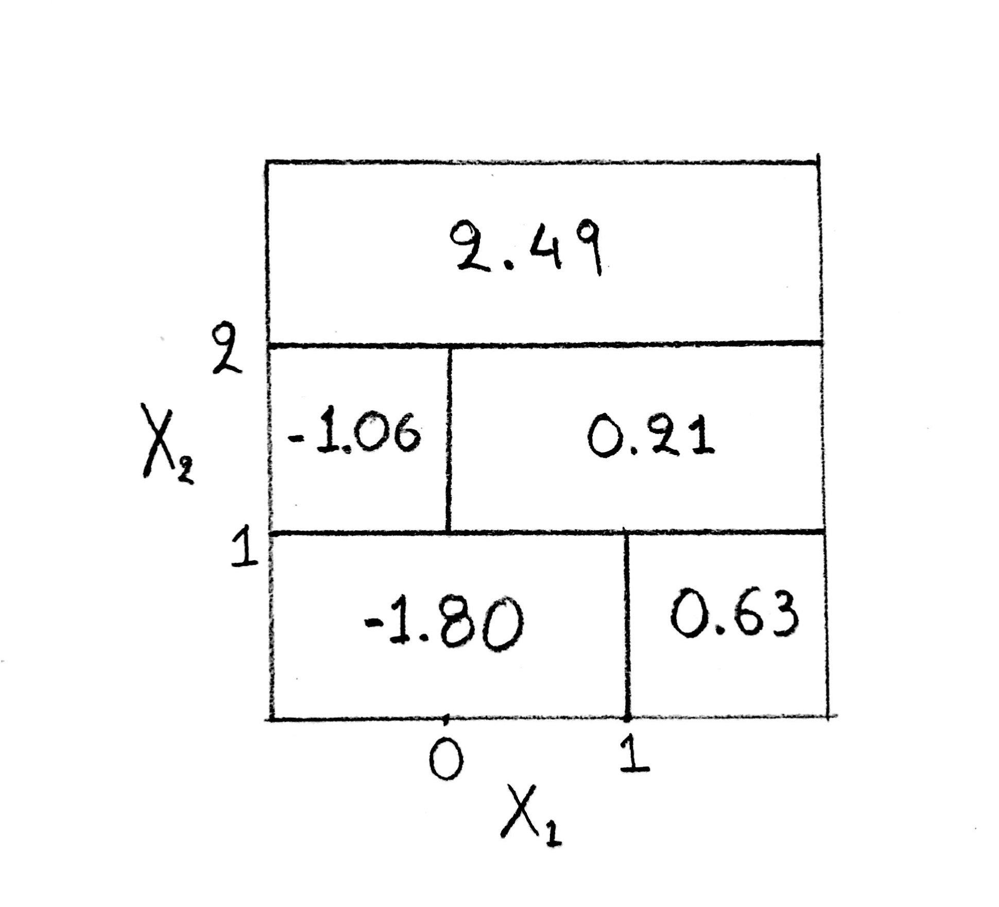

  
  ```{r setup, include=FALSE}
knitr::opts_chunk$set(echo = TRUE)
```

### 1. Decision Trees


**(a)** Sketch the tree corresponding to the partition of the predictor space illustrated in the left-hand panel of the figure above. The numbers inside the boxes indicate the mean of Y within each region.

**Answer**



**(b)** Create a diagram similar to the left-hand panel of the figure, using the tree illustrated in the right-hand panel of the same figure. You should divide up the predictor space into the correct regions, and indicate the mean for each region.

**Answer**




### 2. Regression Trees 

In the lab, a classification tree was applied to the Carseats data set after converting Sales into a qualitative response variable. Now we will seek to predict Sales using regression trees and related approaches, treating the response as a quantitative variable.


**(a)** Split the data set into a training set and a test set.

**Answer**

```{r}
library(ISLR)
attach(Carseats)
set.seed(1)

train <- sample(dim(Carseats)[1],dim(Carseats)[1]/2) #train sample
Carseats.train <- Carseats[train,] #Creating Carseats.train with training data
Carseats.test <- Carseats[-train,] #Creating Carseats.test with test data
```

**(b)** Fit a regression tree to the training set. Plot the tree, and interpret the results. What test error rate do you obtain?

**Answer**

```{r}
library(tree)
tree.carseats <- tree(Sales ~ ., data = Carseats,subset = train) # Fitting Regression Tree
summary(tree.carseats) #Summary the results
```

```{r}
plot(tree.carseats)  #Plot the tree
text(tree.carseats, pretty = 0)
```


```{r}
pred.carseats <- predict(tree.carseats,Carseats.test) #predict
mean((Carseats.test$Sales - pred.carseats)^2) #MSE
```

```{r}
sqrt(mean((Carseats.test$Sales - pred.carseats)^2))
```

We have produced a regression tree with Sales as the response and the other variables as predictors. The tree has actually used six variables **"ShelveLoc", "Price", "Age", "Advertising","Income","CompPrice"**.  The most important variable in order to predict sales is ShelveLoc as the second most important is Price.

Our tree has eighteen (18) terminal nodes and the Residual mean deviance for the tree is 2.36.A small residual mean deviance indicates a good fit to the training data. Test MSE of our tree is 4.1. 

In order to intepret the results better we can calculate RMSE which is equal to 2.04. That means that when we make a prediction based on our model,we expected to miss on average almost 2 units of sales in any prediction.


**(c)** Use cross-validation in order to determine the optimal level of tree complexity. Does pruning the tree improve the test error rate?

**Answer**

```{r}
set.seed(1)
#Using cv.tree() function to determine the optimal level of tree complexity
cv.carseats <- cv.tree(tree.carseats)
cv.carseats
```

In this case,tree of size 8 is selected by cross-validation as the deviance has the lowest value equal to 1109.839 .

We can also plot results to have a better look between size and deviance. We can easily observe that in our case a tree size of 8 gives as the lowest cross validation error as the deviance has the lowest price.

```{r}
set.seed(1)
plot(cv.carseats$size,cv.carseats$dev,type='b')
```

```{r}
# Pruning a Regression Tree , best size = 8 
prune.carseats <- prune.tree(tree.carseats,best=8)
summary(prune.carseats) # summary the results with 8 terminal nodes
plot(prune.carseats) # plot the prunned tree
text(prune.carseats, pretty = 0)
```

```{r}
yhat.prune = predict(prune.carseats,newdata = Carseats.test) 
mean((yhat.prune - Carseats.test$Sales)^2)
```


By using the pruned tree to make predictions on the test set we estimated test MSE to be higher(test MSE = 5.1) than the unpruned tree. That would generally mean that our model may suffer from underfitting.

It is worth mentioning that, a pruned tree will increase the bias and if the reduction of the variance is not significant we may see an increase to MSE(as in our case). Although, we get higher intepretability in our model as we have smaller size in our tree.

**(d)** Use the bagging approach in order to analyze this data. What test error rate do you obtain? Use the importance() function to determine which variables are most important.

**Answer**

```{r}
set.seed(1)
library(randomForest) #insert the library
bag.carseats <- randomForest(Sales ~. , data = Carseats.train, mtry = 10,ntree=500, importance = TRUE) # number of predictors sampled for splitting at each node // 10 indicates that all 10 predictors should be consider for each split of the tree, this indicates bagging
yhat.bag <- predict(bag.carseats, newdata = Carseats.test)
mean((yhat.bag - Carseats.test$Sales)^2)
```

We can see how the bagging approach decreases the Test MSE to 2.6.We construct B regression trees where B is our boostrapped training datasets and then we average the resulting predictions of those B datasets in order to estimate the MSE.

It's worth mentioning, that those B trees are not pruned, so the value of bias estimated to be very low but by averaging these tree we can achieve also a lower variance.As a result, we have a reduction in our MSE which is of course the sum of bias and variance.

In addition, we can now use the **importance()** function to determine which variables are most important.


```{r}
importance(bag.carseats)
```

We can conclude that **"Price"** and **"ShelvecLoc"** are the most important variables in order to predict Sales.   

**(e)** Use random forests to analyze this data. What test error rate do you obtain? Use the importance() function to determine which variables are most important. Describe the effect of m, the number of variables considered at each split, on the error rate obtained.

**Answer**

```{r}
set.seed(1)
rf.carseats <- randomForest(Sales ~ ., data = Carseats.train, mtry = 3, ntree = 500, importance = TRUE)
yhat.rf <- predict(rf.carseats , newdata = Carseats.test)
mean((yhat.rf - Carseats.test$Sales)^2)
```

Random Forests have the same idea as bagging approach,although, each time we build a tree on bootstrapped training sample, we choose m = $\sqrt{p}$ or m = p/3 predictors from the full set of p predictors(bagging approach).By averaging many highly correlated quantities, we don't get large reduction to variance. In order to avoid that, we leave very strong predictors randomly out in each split and "de-corelate" the bagged trees leading to more reduction in variance.

In this case, random forests with m = $p/3$ (usually picked for regression trees) have a higher test MSE equal to 3.2 than the bagging approach where we used all the predictors(m=p) for our B different regression trees.That means that we need those strong predictors inside our each split in order to have a better prediction. Although,we can also see a reduction to the MSE compared to our first simple regression tree methods (pruned and unpruned trees).

```{r}
importance(rf.carseats)
```

We may notice that, in this case  **"Price"** and **"Shelveloc"** are the two most important values in order to predict the Sales of a car . Its worth mentioning, that random forests de-corelates our two most important values of **Price and Shelveloc** and drop their values to 37 and 32 compared to 52 and 42 as we expected.


### 3. Classification Trees

This problem involves the OJ data set which is part of the ISLR package.

**(a)** Create a training set containing a random sample of 800 observations, and a test set containing the remaining observations.

**Answer**

```{r}
library(ISLR)
set.seed(1)
summary(OJ) #summary our data

train <- sample(dim(OJ)[1],800) #train sample with 800 observations
OJ.train <- OJ[train,]  #create OJ.train
OJ.test <- OJ[-train,] #create OJ.test(remaining observations)
```

**(b)** Fit a tree to the training data, with Purchase as the response and the other variables as predictors. Use the summary() function to produce summary statistics about the tree, and describe the results obtained. What is the training error rate? How many terminal nodes does the tree have?

**Answer**

```{r}
library(tree)

oj.tree <- tree(Purchase ~ ., data = OJ.train,method="class") # Fit a tree to the training data with Purchase as the response and the other variables as predictors
summary(oj.tree) #summary our tree
```

We have produced a classification tree with Purchace as the response and the other variables as predictors. The tree has actually used four variables **"LoyalCH", "PriceDiff", "SpecialCH" and "ListPriceDiff"**. Our tree has eight (8) terminal nodes and the Training Error rate (Misclassification error rate) for the tree is 0.165

**(c)** Type in the name of the tree object in order to get a detailed text output. Pick one of the terminal nodes, and interpret the information displayed.

**Answer**

```{r}
oj.tree
```

We will pick randomly node **20)** in order to interpred the information displayed.

First, we can see the name of the splitting variable (SpecialCH) and the split criterion which in this case is SpecialCH < 0.5. Then we have the number of observations in that branch (70) and the deviance = 60.89.Next, MM is the the classification of Sales chosen from the possible classes of CH or MM. In addition,we get the fraction of observations in that branch that take on values of CH(16%) and MM(84%) where the first fraction indicates CH and the second indicates MM. Lastly, asterisk ( * ) indicates that our branch lead to terminal node.

**(d)** Create a plot of the tree, and interpret the results.

**Answer**

```{r}
plot(oj.tree)
text(oj.tree, pretty = 0)
```

We can conclude that **"LoyalCH"** is the most important variable of the tree. If we have values that LoyalCH is smaller than 26% we predict that our sales value is MM otherwise if LoyalCH is greater than 76% our sales value is CH. In the middle where 26% < LoyalCH < 76% our decision depends also from PriceDiff , ListPriceDiff and SpecialCH.It is worth mentioning, that the response value of MM is predicted in both situation on the left side of our tree. The split is performed because it leads to increased node purity even though it does not reduce the classification error.  


**(e)** Predict the response on the test data, and produce a confusion matrix comparing the test labels to the predicted test labels. What is the test error rate?

**Answer**

```{r}
oj.pred.test <- predict(oj.tree, OJ.test, type = "class")
table(oj.pred.test,OJ.test$Purchase)
```

```{r}
missclass <- sum(OJ.test$Purchase != oj.pred.test)
missclass/length(oj.pred.test) # (49+12)/(147+62+49+12) test error rate 
```

Test Error Rate is approximately 22.6 %.

**(f)** Apply the cv.tree() function to the training set in order to determine the optimal tree size.

**Answer**

```{r}
set.seed(1)
cv.oj <- cv.tree(oj.tree,FUN=prune.misclass)
cv.oj
```

We can see that the lowest cross validation error is for the size = 5 and size = 8 where the cross validation error is equal to 152. Early pruning method, indicates that we have to prune our tree at size = 5 if there is no significant reduce in our cross validation error after that point. By pruning the tree to be size = 5 , we can get no only a better interpetation but also our model is more efficient.

**(g)** Produce a plot with tree size on the x-axis and cross-validated classification error rate on the y-axis.

**Answer**

The plot of size and deviance indicates that a tree with 5 terminal nodes and 8 terminal nodes will have the same deviance as we expected.

```{r}
plot(cv.oj$size, cv.oj$dev, type = "b" , xlab ="Tree size", ylab = " Deviance")
```

**(h)** Which tree size corresponds to the lowest cross-validated classification error rate?

**Answer**

We can  observe that a tree size of 5 nodes and tree of 8 nodes have the lowest cross-validation error.

**(i)** Produce a pruned tree corresponding to the optimal tree size obtained using cross-validation. If cross-validation does not lead to selection of a pruned tree, then create a pruned tree with five terminal nodes.

**Answer**

```{r}
oj.prune <- prune.misclass(oj.tree, best = 5)
plot(oj.prune)
text(oj.prune,pretty=0)
```

We can see that our pruned tree with size = 5 contains thre variables **LoyalCH**, **PriceDiff** and **SpecialCH** as in the unpruned tree we had 4. Of course, **LoyalCH** is the most important variable, as the PriceDiff is the second most important. 

**(j)** Compare the training error rates between the pruned and unpruned trees. Which is higher?

```{r}
summary(oj.prune)
```

Training Error Rate in pruned tree is 0.165 same asthe training error rate in the unpruned tree. As it has already been mentioned, with smaller tree we gain higher intepretability in our model and it is more efficient because we build smaller tree.

**(k)** Compare the test error rates between the pruned and unpruned trees. Which is higher?

**Answer**

```{r}
yhat.pruned <- predict(oj.prune, OJ.test, type = "class")
table(yhat.pruned,OJ.test$Purchase)
```


```{r}
missclass.pruned <- sum(OJ.test$Purchase != yhat.pruned)
missclass.pruned/length(yhat.pruned)
```

In this case, Pruned tree has exactly the same test error rate equal to 22.6% as the unpruned tree. Of course, this could change if we set different seeds during the spliting of the data into test and training set and also the cross validation stage.


### 4. SVM

In this problem, you will use support vector approaches in order to predict whether a given car gets high or
low gas mileage based on the Auto data set.

**(a)** Create a binary variable that takes on a 1 for cars with gas mileage above the median, and a 0 for cars
with gas mileage below the median.

**Answer**

```{r}
library(ISLR)
Auto_b <- Auto
gas.median <- median(Auto$mpg)
bin.var <- ifelse(Auto$mpg > gas.median, 1 , 0) #create the binary variable
Auto_b$mpglevel = as.factor(bin.var)
Auto_b$mpg <-NULL #remove mpg as we have already created mpglevel
Auto_b$name <- NULL #remove name
```


**(b)** Fit a support vector classifier to the data with various values of cost, in order to predict whether a car gets high or low gas mileage. Report the cross-validation errors associated with different values of this parameter. Comment on your results.

**Answer**

```{r}
library(e1071)
set.seed(1)
tune.out <-tune(svm,mpglevel~.,data=Auto_b,kernel="linear",ranges=list(cost=c(0.001,0.01,0.1,1,5,10,100))) 
summary(tune.out)
```

After, we have compared SVMs with a linear kernel using a range of values of the cost parameter we found that cost=100 has the best performance of 0.087.On the other hand, we can observe that for cost = 0.001 we have the highest cross-validation error to be 0.135. In order to find the optimum parameter, tune function has used by default 10-fold cross validation and found all differents results for differents cost values.


**(c)** Now repeat (b), this time using SVMs with radial and polynomial basis kernels, with different values of gamma and degree and cost. Comment on your results.

**Answer**

```{r}
set.seed(1)
tune.out <- tune(svm, mpglevel ~ ., data = Auto_b, kernel = "polynomial" , ranges = list(cost = c(0.001,0.01,0.1,1,5,10,100), degree = c(2,3,4)))
summary(tune.out)
```

For polynomial SVMs we get the best performance (lowest cross-validation error) to be 0.079 for cost = 5 and degree = 3. It is worth mentioning,that tune function has used 10-fold cross validation by default and had found exactly the same error for cost = 10 and degree = 3.Last but not least,we have the highest cross-validation error equal to 0.56 for cost=0.01 and degree=2

```{r}
set.seed(1)
tune.out <- tune(svm, mpglevel ~ ., data = Auto_b, kernel = "radial" , ranges = list(cost = c(0.1,1,10,100,1000), gamma = c(0.5,1,2,3,4)))
summary(tune.out)
```

Finally, for radial kernel, the lowest cross-validation error is 0.074 for cost = 1 and gamma = 1 which is the best performance between all models (linear,polynomial,radial).

**(d)** Make some plots to back up your assertions in (b) and (c).

**Answer**

```{r}
svm.linear1 <- svm(mpglevel ~ weight + acceleration, data = Auto_b, kernel = "linear", cost = 100) #fit a svm linear model only for mpg with predictors to be weight abd acceleration
plot(svm.linear1, Auto_b, weight~acceleration)
```


```{r}
svm.poly <- svm(mpglevel ~ displacement + cylinders,data = Auto_b, kernel = "polynomial",cost =5,degree=3)
plot(svm.poly,Auto_b, displacement~cylinders ) # 
```

```{r}
svm.radial2 <- svm(mpglevel ~ origin + horsepower, data = Auto_b ,kernel = "radial", cost = 1 , gamma = 1)
plot(svm.radial2,Auto_b,horsepower~origin) #svm with radial kernel , plot mpg ~ acceleration
```

```{r}
svm.linear2 <- svm(mpglevel ~ weight + cylinders, data = Auto_b, kernel = "linear", cost = 100)
plot(svm.linear2,Auto_b,weight~cylinders) # svm with linear kernel, plot mpg ~weight
```
```{r}
svm.radial3 <- svm(mpglevel ~ acceleration + horsepower, data = Auto_b ,kernel = "radial", cost = 1 , gamma = 1)
plot(svm.radial3,Auto_b,horsepower~acceleration)
```

We can easily observe from the plots, how in general radial kernels seperate our data in a better and more flexible way. This is what we expected to see, as we have already got the lowest cross validation error.

It is also easy to observe, how the model can overfit the data if we raise sharply our gamma parameter in the graph below.In that case, we expect to have of course higher test MSE and acceleration and hoursepower would not predict very well whether a car gets high or low gas mileage (pink and blue font) .


```{r}
svm.radial4 <- svm(mpglevel ~ acceleration + horsepower, data = Auto_b ,kernel = "radial", cost = 1 , gamma = 100)
plot(svm.radial4,Auto_b,horsepower~acceleration)
```


### 5. SVM

Here we explore the maximal margin classifier on a toy data set. **(a)** We are given n = 7 observations in p = 2 dimensions. For each observation, there is an associated class label. Sketch the observations.

**Answer**

```{r}
x1 <- c(3,2,4,1,2,4,4)
x2 <- c(4,2,4,4,1,3,1)
colours = c("red","red","red","red","blue","blue","blue")
plot(x1,x2,col = colours , xlab = "X1", ylab = "X2" )
```


**(b)** Sketch the optimal separating hyperplane, and provide the equation for this hyperplane of the following form.

  $\beta_0 + \beta_1X_1 + \beta_2X_2 = 0$


**Answer**

In our case,classes are linearly seperable and we fit the optimal seperating hyperplane between observations(support vectors) '2','3' and '5','6'.

For the first pair of observations we have (2,2) and (2,1)
and the second pair is (4,4) and (4,3) if we substract them we have

=> (2,1.5),(4,3.5) pair in which we will fit our hyperplane

$y = mx + b$

Gradient(slope) $m = (y_2 - y_1)/(x_2 - x_1)$

In our case $m = (3.5-1.5)/(4-2) = 1$

so for m = 1 => y = x + b

We take one point of our line e.g. (2,1.5) we have  1.5 = 2 + b => b =  -0.5

so for b = -0.5 and m = 1 our equation will be calculated as $X_1 = X_2 - 0.5$ and our hyperplane would be $0.5 + X_1 - X_2  = 0$

```{r}
plot(x1,x2,col = colours,xlim = c(0,5),ylim = c(0,5))
abline(-0.5,1)
```

**(c)** Describe the classification rule for the maximal margin classifier. It should be something along the lines of "Classify to Red if $\beta_0 + \beta_1X_1 + \beta_2X_2 > 0$, and classify to Blue otherwise." Provide the values for $\beta_0, \beta_1$, and $\beta_2$.

**Answer**

In general, we can use an infinite number of hyperplanes in order to seperate our data.After we found a possible hyperplane we can compute the perpendicular distance from each observation to our hyperplane,then the minimum distance is called the margin. As a result,the maximal margin hyperplane is a hyperplane that has the largest margin or the farthest minimum distance to the observations. Building a maximal margin hyperplane gives us the ability to classify further a test observation based on which side of the maximal margin hyperplane it is.
.
In our case the classification rule for the maximal margin classifier will be : "Classify to **Red** if $0.5 + X_1 - X_2  > 0$ and "Classify to **Blue** otherwise"

If we want for example to classify a test obsercation ($X_1,X_2$) we will apply the classification rule for the maximal margin classifier and see where our observation lies.

**(d)** On your sketch, indicate the margin for the maximal margin hyperplane.

**Answer**

```{r}
plot(x1,x2,col=colours,xlim = c(0,5) , ylim = c(0,5))
abline(-0.5,1)
abline(-1,1,lty = 2) # blue support vectors (they are on the margin and support the maximal margin line)
abline(0,1,lty = 2) #red support vectors (they are on the margin and support the maximal margin line)
lines(x = c(2,1.9), y = c(1,1.39))
text(x = 2.2 , y = 1.4 , labels = "margin", cex = 0.8)
text(x = 2.4 , y = 2.1 , labels = "margin", cex = 0.8)
lines(x = c(2,2.1),y = c(2,1.60))
```


The margin is the perpendicular distance between support vectors and the seperation line(hyperplane). From the general formula the distance from a point $(x_0,y_0)$ to the line $\beta_0 + \beta_1X_1 + \beta_2X_2=0$ is: 

$d = \frac{\mid{x_0\beta_1 + y_0\beta_2 + \beta_0}\mid}{\sqrt{\beta_1^2 + \beta_2^2}}$

so for $(2,2)$ and $X_1 - X_2 -0.5=0$ , $margin = \frac{\sqrt2}{4}$ 

**(e)** Indicate the support vectors for the maximal margin classifier.

**Answer**

The support vectors are the points (2,1),(2,2),(4,3),(4,3). These four observations, are exactly on the margin and "support" the maximal margin hyperplane. If these four points were moved, then the maximal margin line yould move as well.

```{r}
plot(x1,x2,col=colours,xlim = c(0,5) , ylim = c(0,5))
abline(-0.5,1)
abline(-1,1,lty = 2)  
abline(0,1,lty = 2)
points(2,2, pch=13,col="black",cex=2)
points(2,1, pch=13,col="black",cex=2)
points(4,4, pch=13,col="black",cex=2)
points(4,3, pch=13,col="black",cex=2)
```

**(f)** Argue that a slight movement of the seventh observation would not affect the maximal margin hyperplane.

**Answer**

A slight movement of the seventh observation (4,1) will not affect the maximal margin hyperplane. The maximal margin hyperplane as we said before depends only from the supports vectors which in our case are (2,1),(2,2),(4,3),(4,4). Any movements of the other observations will not affect our hyperplane as long as they stay outside the boundary of our margin. 

**(g)** Sketch a hyperplane that is not the optimal separating hyperplane, and provide the equation for this hyperplane.

**Answer**

We can choose a line that seperates our two classes but without being the optimal seperating hyperplane.

```{r}
plot(x1,x2,col=colours,xlim = c(0,5) , ylim = c(0,5))
abline(-0.55,1.1)
```

Then our new hyperplane will have an equation such as :

$0.55 + X_1 - 1.1X_2  = 0$   (Not the optimal hyperplane)

**(h)** Draw an additional observation on the plot so that the two classes are no longer separable by a hyperplane.

**Answer**

Lets add for example 8th observation,the pair of (4,2) class of "red". Then our plot will be :

```{r}
plot(x1,x2,col=colours,xlim = c(0,5) , ylim = c(0,5))
points(4,2,col="red")
text(x=4.5,y=2,labels = "8th observation",cex=0.7) 
```

We can easily observe that there is not a linear seperation between our two classes  and we have to examine different ways (e.g. polynomial, radial) to seperate our classes  successfully.

### 6. Hierarchical clustering

Consider the USArrests data. We will now perform hierarchical clustering on the states.

**(a)** Using hierarchical clustering with complete linkage and Euclidean distance, cluster the states.

**Answer**

```{r}
library(ISLR)
set.seed(1)
summary(USArrests)
hc.complete <- hclust(dist(USArrests),method="complete")
plot(hc.complete, main = "Complete Linkage",xlab = "",ylab="",cex=0.9)
```

The hclust() function implements hierarchical custering while we used "complete" (linkage clustering) method on USArrests data set from ISLR library.

**(b)** Cut the dendrogram at a height that results in three distinct clusters. Which states belong to which clusters?

**Answer**


First, we will use cutree function with three as an argument in order to cut our tree in three distinct clusters 

```{r}
cutree(hc.complete,3)
```

From the table above we can see exactly the states and the cluster which are belong to. For example Michigan belongs to the first cluster,Pennsylvania to the third cluster and New Jersey to the second cluster. With the "table" function we can also observe that twenty states in total belong to the thrird cluster,sixteen states belong to the first cluster and lastly fourteen states belong to the second cluster.

```{r}
table(cutree(hc.complete,3))
```

**(c)** Hierarchically cluster the states using complete linkage and Euclidean distance, after scaling the variables to have standard deviation one.

**Answer**

```{r}
xsc <- scale(USArrests) #Used to scale the variables before performing Hierarchically cluster
hc.scomplete <- hclust(dist(xsc), method = "complete")
plot(hc.scomplete,main = "US Arrests (scaled)")
```

As the variables are scaled to have standard deviation one,then, each variable will effect equally our Hierarchical clustering method and the same importance will be given to each one of them.

**(d)** What effect does scaling the variables have on the hierarchical clustering obtained? In your opinion, should the variables be scaled before the inter-observation dissimilarities are computed? Provide a justification for your answer.

**Answer**

```{r}
cutree(hc.scomplete,3)
```

```{r}
table(cutree(hc.scomplete,3))
```

Scaling the variable effects not only the height of our dendrogram, but also the clusters,where our first cluster after scaling has eight states instead of 16, the second has eleven instead of fourteen and the third cluster has thirty-one states instead of twenty states. 

Our dataset contains statistics in arrests per 100,000 residents for Assualt, Murder and Rape in each of the 50 US states. Although the population living in the urban areas is measured in percentage. In my opinion,we have to scale our data mostly because our variables are measured on different scales,otherwise the choice of units(per-100.000 and percent) will greatly affect the dissimilarity measure obtained.

### 7. PCA and K-Means Clustering

In this problem, you will generate simulated data, and then perform PCA and K-means clustering on the data.

(a) Generate a simulated data set with 20 observations in each of three classes (i.e. 60 observations total), and 50 variables.

**Hint**: There are a number of functions in R that you can use to generate data. One example is the rnorm() function; runif() is another option. Be sure to add a mean shift to the observations in each class so that there are three distinct classes.

**Answer**


```{r}
set.seed(1)
data <- matrix(nrow=60, ncol=50) 

# for i in every column we split our data in to 3 different regions in order to create three different classes. We choose mean sample from 1 to 100 and for the different classes we choose different values for mean (e.g. mean=6 and mean=-6)

for(i in 1:ncol(data)) {
  mean <- sample(1:100, size = 1)
  data[1:20,i] <- rnorm(20,mean=6)
  data[21:40,i]<- rnorm(20, mean=0)
  data[41:60,i]<- rnorm(20, mean=-6)
}
plot(data)
```

**(b)** Perform PCA on the 60 observations and plot the first two principal components??? eigenvector. Use a different color to indicate the observations in each of the three classes. If the three classes appear separated in this plot, then continue on to part (c). If not, then return to part (a) and modify the simulation so that there is greater separation between the three classes. Do not continue to part (c) until the three classes show at least some separation in the first two principal component eigenvectors.

**Answer**

First, we create data_pca which is our PCA method on the 60 observations and after that we plot the first two principal compontents eigenvector with different colours in order to indicate our three different classes.

```{r}
data_pca <- prcomp(data, scale = TRUE)
plot(data_pca$x[,1],data_pca$x[,2],col=c(rep("green",20),rep("red",20),rep("purple",20)),pch = 20, xlab = "First Principal Component",ylab = "Second Principal Component ")
```


**(c)** Perform K-means clustering of the observations with K = 3. How well do the clusters that you obtained in K-means clustering compare to the true class labels?

**Hint:** You can use the table() function in R to compare the true class labels to the class labels obtained by clustering. Be careful how you interpret the results: K-means clustering will arbitrarily number the clusters, so you cannot simply check whether the true class labels and clustering labels are the same.

**Answer**

We performed K-means algorithm with K = 3 and nstart = 20.Initially, K-means algorithm randomly assigns classses and computes clusters centroids. After that, it assigns observations to the closest cluster centroid and then repeats the process for as many iterations as we have defined in nstart.

From the table, we can see that our K-means method had succesfully divided our classes in three different subgroups of 20 observations each, which is the same as our simulated data set.


```{r}
set.seed(1)
km.out <- kmeans(data, 3, nstart = 20)
km.out$cluster
table(km.out$cluster, c(rep(1,20), rep(2,20), rep(3,20)))
```

**(d)** Perform K-means clustering with K = 2. Describe your results.


```{r}
set.seed(1)
km.out <- kmeans(data, 2 , nstart = 20)

km.out$cluster

table(km.out$cluster, c(rep(1,20), rep(2,20), rep(3,20)))
```

In this case,K-means algorithm with K=2 forced our simulated data to be seperated by 2 clusters So the second class "2"(observations 21-40) have been absorbed and now we have only 2 classes "1" and "2". To be more specific, the first class has absorbed all the points from the class "2" and from the table we can see that we have 40 observations in class "1". On the other hand, class "3" has its initial 20 observations.

It is more clearly if we observe the plot below.(class "1" contains observations 1-40, class "3" contains observations 41-60)

```{r}
plot(km.out$cluster)
```

**(e)** Now perform K-means clustering with K = 4, and describe your results.

```{r}
set.seed(1)
km.out <- kmeans(data, 4 , nstart = 20)

km.out$cluster

table(km.out$cluster, c(rep(1,20), rep(2,20), rep(3,20)))
```


In this case,K-means algorithm with K=4 has seperated our simulated data in 4 clusters(randomly assigned class labels "1","2","3" and "4"). We can observe, that our first two classes have maintened 20 observations each (in our case class "2" and class "4"). On the other hand, our third class has been divided exactly in 2 different clusters "3" and "1" of 10 observations each.

From the graph below, we can also see how our third class (observations 41-60) has been divided into two new clusters "3" and "1".

```{r}

plot(km.out$cluster)

```


**(f)** Now perform K-means clustering with K = 3 on the first two principal components, rather than on the raw data. That is, perform K-means clustering on the 60 ?? 2 matrix of which the first column is the first principal component???s corresponding eigenvector, and the second column is the second principal component???s corresponding eigenvector. Comment on the results.

**Answer**

```{r}
summary(data_pca)
```

To begin with,we can observe that our first principal component is a reflection of 95.97% of the variations in the data and the second principal component is 0.03%. The cumulative proportion of those PCA 1 and PCA 2 is 96.3% , by that we mean that the first two principal components explain around 96.3% of the variance in our simulated data. We can expect that by performing K-mean method with K=3 we will see the same separation into three clusters of 20 observations each.

We can also use a plot in order to see the proportion of variance explained in our simulated data set by each principal component.

```{r}
plot(data_pca,type="l")
```

```{r}
set.seed(1)

km.out <- kmeans(data_pca$x[,1:2], centers = 3, nstart=20)

summary(km.out$cluster)

km.out$cluster
```

As we expected, by performing K-means algorithm with K=3 we have separated our simulated data in 3 clusters "1","2" and "3" which one of them contains 20 observations as when we used K-means method in the whole dataset(50 variables of 60 observations).We can also see it clearly from the table below.

```{r}

table(km.out$cluster, c(rep(1,20), rep(2,20), rep(3,20)))

```


**(g)** Using the scale() function, perform K-means clustering with K = 3 on the data after scaling each variable to have standard deviation one. How do these results compare to those obtained in (b)? Explain.

```{r}
set.seed(1)

data.scaled <- scale(data, scale = TRUE)

kmscaled.out <- kmeans(data.scaled,centers=3)

kmscaled.out$cluster
```

First we need to scale our data so each variable to have standard deviation one, which is by default the case in scale() function. After that, we use K-means clustering with K=3 on our new scaled data. The results are the same as those we have obtained in question b. We have three different clusters "1","2" and "3" which each containing 20 observations.We can see it clearly from the table below.

```{r}
table(km.out$cluster, c(rep(1,20), rep(2,20), rep(3,20)))
```

Of course the result is what we expected to have, as we initially generated our variables measured in the same type of units and the same order of magnitude. Then scaling wil not affect our result.

Although, in real life data scaling is recommended as we often have variables measured by different type of units and different order of magnitude. That would mean that some variables will seem to be more important than they actually are and that will have a negative effect in our analysis. 

